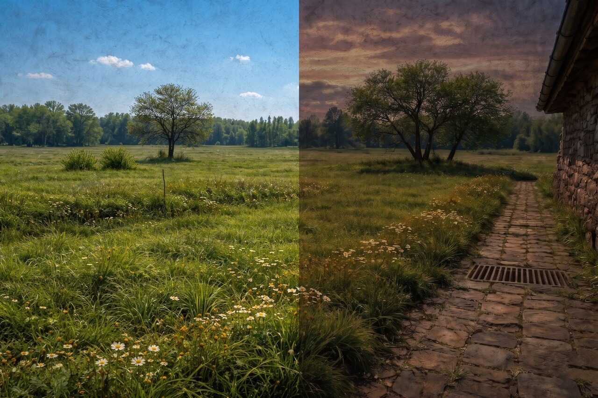

# ponor-wallpaper

[](LICENSE)

macOS light/dark dynamic wallpapers, built from PNG pairs.



## Layout

```
src/<name>/light.png   source image shown in Light mode
src/<name>/dark.png    source image shown in Dark mode
dist/<name>.heic       built wallpaper (gitignored)
```

## Build

```sh
./build.sh              # builds ponor-brush by default
./build.sh <name>       # builds src/<name>/ → dist/<name>.heic
```

Then in System Settings → Wallpaper → Add Photo, pick the `.heic` and set the
dropdown to **Automatic** so it follows the system appearance.

## Requirements

```sh
brew install imagemagick libheif exiftool
```

## How it works

`build.sh` resizes the light source to match the dark source's dimensions,
packs both images into a single HEIC with `heif-enc`, and writes an
`apple_desktop:apr` XMP tag (a base64-encoded plist mapping `{l: 0, d: 1}`) so
macOS knows which frame is which.

## License

Wallpapers © Genadi Samokovarov, licensed under [CC BY 4.0](LICENSE). Use them
anywhere, just credit back.
